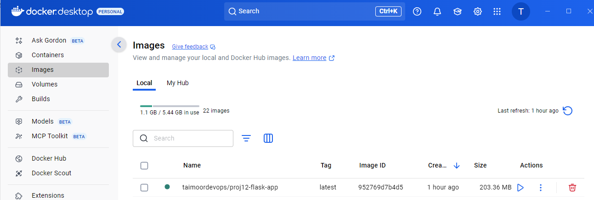
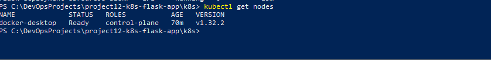
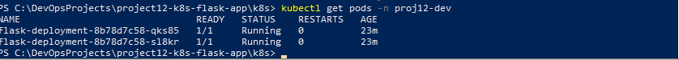
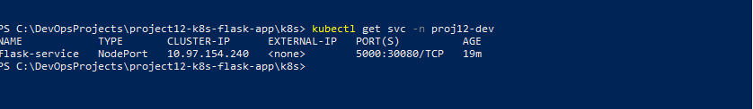
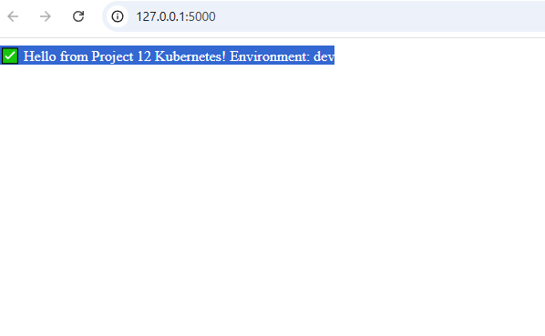
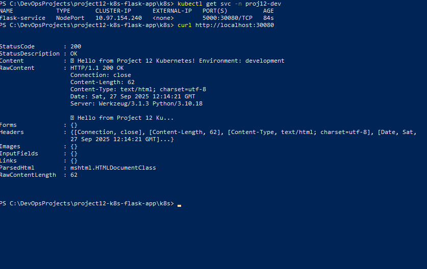

#  Project 12 – Kubernetes Deployment of Python Flask App  

This project demonstrates how to deploy and manage a Python Flask application on Kubernetes using **Docker**, **kubectl**, and **Helm (optional)**. It also introduces background workloads with Kubernetes **CronJobs**, proving real-world DevOps and Cloud Engineering skills.  

---

##  Objectives  

- Deploy a **Python Flask app** to Kubernetes as a scalable service.  
- Configure Kubernetes objects: **Deployment, Service, ConfigMap, Secret, CronJob** (Ingress optional).  
- Automate container **build & push** with Docker.  
- Run a **Kubernetes CronJob** executing a Python script.  
- Demonstrate **monitoring, scaling, and self-healing** features of Kubernetes.  
- Show hands-on **DevOps + Python integration**.  

---

##  Architecture  

                ┌───────────────────────────────────┐
                │            Users 🌍               │
                └───────────────┬───────────────────┘
                                │
                       [Ingress / NodePort]
                                │
                        ┌───────┴────────┐
                        │  Flask Service │
                        └───────┬────────┘
                                │
                      ┌─────────┴─────────┐
                      │   Flask Pods (2)  │  <- Deployment
                      └─────────┬─────────┘
                                │
                      ┌─────────┴─────────┐
                      │ ConfigMap + Secret│
                      └────────────────────┘

                       ┌────────────────────┐
                       │  CronJob (Python)  │  -> Runs periodic batch task
                       └────────────────────┘
## 📂 Repo Structure   
```
project12-k8s-flask-app/
│
├── app/
│ ├── app.py
│ ├── requirements.txt
│ └── Dockerfile
│
├── k8s/
│ ├── namespace.yaml
│ ├── configmap.yaml
│ ├── secret.yaml
│ ├── deployment.yaml
│ ├── service.yaml
│ └── cronjob.yaml
│
├── screenshots/
│ ├── docker-desktop-images.png
│ ├── docker-desktop-k8s.png
│ ├── kubectl-nodes.png
│ ├── kubectl-pods.png
│ ├── kubectl-svc.png
│ ├── flask_app_browser.png
│ └── flask-app-curl.png
│
└── README.md
## ⚙️ Steps Performed  

1. **Built & Pushed Docker Image**  
   - Flask app containerized (`app/Dockerfile`).  
   - Image pushed to Docker Hub → `taimoordevops/proj12-flask-app:latest`.  

2. **Set up Kubernetes Namespace & Config**  
   - Created `proj12-dev` namespace.  
   - Added `ConfigMap` (env vars) and `Secret` (base64-encoded secret key).  

3. **Deployed Flask App**  
   - Used `Deployment` with **2 replicas**.  
   - Exposed app via `Service` (NodePort → `localhost:30080`).  

4. **Verified Application**  
   - Accessed Flask app via browser + cURL.  
   - Confirmed both replicas running and serving traffic.  

5. **(Optional) CronJob**  
   - Created CronJob YAML for periodic background Python task.  

---

## Screenshots  

### 1. Docker Desktop  
- **Built Docker Image**  
    

- **Kubernetes Tab – Pods & Services Running**  
    

### 2. Kubernetes via CLI  
- **Cluster Node**  
    

- **Pods Status**  
    

- **Service (NodePort)**  
    

### 3. Application Verification  
- **Flask App in Browser (http://localhost:30080)**  
    

- **cURL Verification**  
    
## Author  

**Taimoor Zain**  
-  DevOps & Cloud Engineer | Transitioning from 12+ years in Software Engineering (.NET/C#)  
- 🔗 [GitHub](https://github.com/taimoordevops) | [LinkedIn](https://linkedin.com/in/taimoorzain)  

---